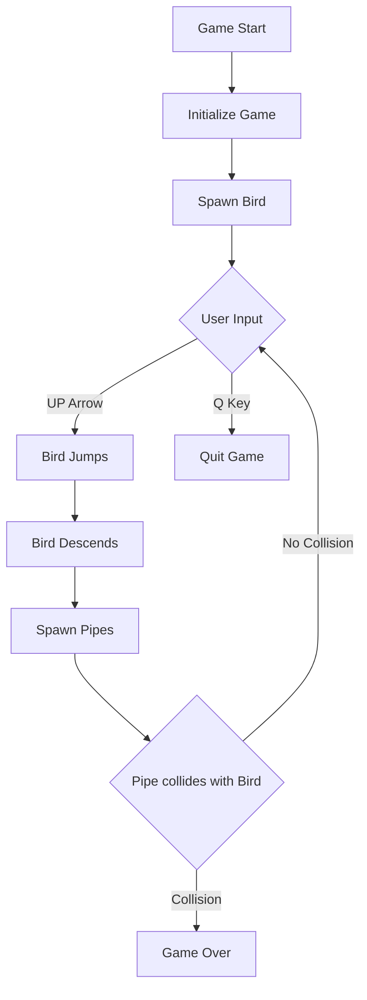

# ClappyBird
The famous game but in terminal written in C

> Credits:
> - [Rafay Siddiqui](https://github.com/R4F4I)
> - [Masoom Khan](https://github.com/jetstarfish5599)
> - [Dev Uthmani](https://github.com/devutmani)

# Functionality
## 🎮 Game Mechanics and Functionality

### 🕹️ Controls
- `Q`: Quit the game
- `UP Arrow`: Make the bird jump/move upwards
  - After jumping, the bird will automatically descend at a constant rate

### 🖼️ Game Environment
- Defined game frame with specific:
  - Height
  - Width
  - Consistent update rate

### 🧩 Core Components

#### 🐦 Bird
- **Characteristics**:
  - Single bird type
  - Movement:
    - User-controlled upward jump
    - Automatic downward descent
  - Collision Detection:
    - Game ends if bird hits pipes

#### 🚧 Pipes
- **Types**:
  1. Up Pipe
  2. Middle Pipe
  3. Down Pipe

- **Behavior**:
  - Spawn randomly within game frame
  - Move towards the bird
  - Collision rules:
    - Matching pipe type with bird position = Continue game
    - Mismatched position = Game over

### 🔄 Gameplay Flow




## 🛠️ Technical Implementation Notes

**Key Functions**

```C
void initializeGame();     // Set up game frame and initial state AKA main(){}
void updateBirdPosition(); // Handle bird movement
void generatePipes();      // Create random pipe configurations
void checkCollision();     // Detect bird-pipe interactions
```

### Recommended Libraries
- Windows Console Graphics
- Random number generation
- Time-based updates

### 📊 Performance Considerations
-Efficient screen clearing
-Minimal computational overhead
-Smooth frame updates

### 🚀 Potential Enhancements
-Score tracking
-Difficulty progression
-Multiple bird/pipe skins


### 🛡️ Error Handling
- Graceful game exit
- Input validation
- Memory management

