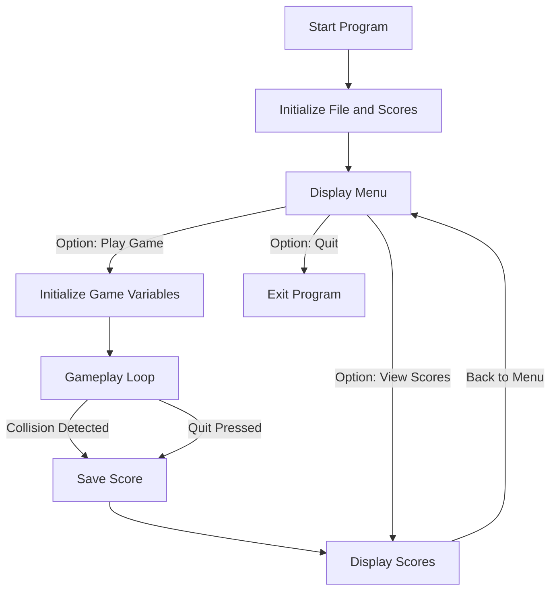

<div align="center">

# ClappyBird


</div>

##  1. <a name='TableofContents'></a>Table of Contents
- [ClappyBird](#clappybird)
[1. Table of Contents](#1-table-of-contents)
[2. about](#2-about)
[3. Credits](#3-credits)
[4. Overview](#4-overview)
[5. Features](#5-features)
[6. Files](#6-files)
[7. Compilation Instructions](#7-compilation-instructions)
[8. Control Flow](#8-control-flow)
[9. Key Functions](#9-key-functions)

---

##  2. <a name='about'></a>about
 - simple c project made for uni

##  3. <a name='Credits'></a>Credits

- https://gist.github.com/smvd/aeaa7544f75988081285ab399c2579c7
>  for code structure inspiration, also for using APIs


##  4. <a name='Overview'></a>Overview

This project implements a console-based Flappy Bird game using the Windows API and C standard libraries. Players control a bird to navigate through obstacles while trying to achieve the highest score possible. The game features AI competition, score tracking, and an interactive menu system.

##  5. <a name='Features'></a>Features
- **Interactive Gameplay**: Players use the keyboard to control the bird.
- **Bot**: Compete against another bird.
- **Score Saving**: Automatically saves and displays top scores.


##  6. <a name='Files'></a>Files
- `main.c`: Contains the game logic and implementation.
- `scores_list.txt`: File to save and retrieve player scores.

##  7. <a name='CompilationInstructions'></a>Compilation Instructions
1. Ensure you have a C compiler installed.
2. Open a terminal or command prompt.
3. Navigate to the directory containing the `main.c` file.
4. Compile the program using the following command:
   ```bash
   gcc .\main.c -o flappy_bird.exe
   ```
5. Run the compiled program:
   ```bash
   ./flappy_bird.exe
   ```


##  8. <a name='ControlFlow'></a>Control Flow
Below is the control flow of the game implemented in `main.c`:

<!---  --->




##  9. <a name='KeyFunctions'></a>Key Functions
- `clear_screen()`: Clears the console screen.
- `update_border()`, `update_pipes()`, `update_birds()`: Update the visual elements on the screen.
- `print_screen()`: Displays the current game state.
- `collision()`: Detects collisions with pipes or the ground.
- `fetch_scores()`, `write_to_file()`: Manage the score file.