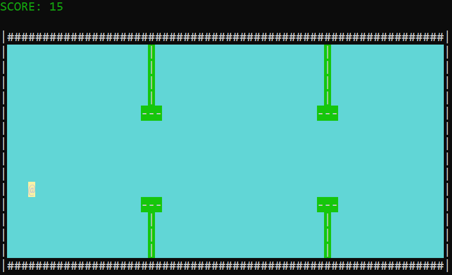
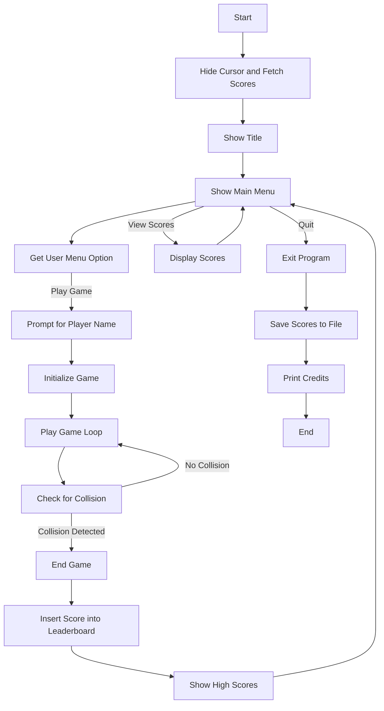

<div align="center">

# ClappyBird


</div>

## Table of Contents
1. [Overview](#overview)
2. [Installation Instructions](#installation-instructions)
3. [Gameplay Instructions](#gameplay-instructions)
4. [Control Flow](#control-flow)
5. [Program Features](#program-features)
6. [Credits](#credits)

---

## Overview

This is a simple, text-based version of the popular **Flappy Bird** game implemented in **C**. It simulates the movement of a bird inside a frame, where the player controls the bird's vertical movement and tries to avoid colliding with pipes that appear randomly. The game features scoring, and the player's score is saved in a text file to track the top 10 high scores. The game also supports viewing high scores and credits.

---

## Installation Instructions

To run the game:

1. **Clone or download the repository**.
2. **Compile** the `main.c` file using a C compiler:
   ```
   gcc main.c -o flappy_bird_game.exe
   ```
3. **Run the game**:
   ```
   ./flappy_bird_game.exe
   ```

**Dependencies**: The program uses the Windows API for handling asynchronous key presses and hiding the cursor. This is specifically designed for Windows systems.

---

## Gameplay Instructions

1. **Start the Game**: Select "PLAY GAME" from the main menu.
2. **Control the Bird**:
   - **Press `W`** to make the bird fly up.
   - **Press `Q`** to quit the game.
   - The bird will start descending at a constant rate after flying up.
3. **Goal**: Avoid the pipes and survive as long as possible.
   - Pipes move towards the bird from right to left.
   - If the bird collides with a pipe or hits the ground, the game ends.
4. **Scoring**: Your score is based on how long you survive.
5. **High Scores**: View the top 10 scores at any time from the main menu.
6. **Exit**: You can exit the game from the main menu.

---

## Control Flow

Below is a **diagram** illustrating the control flow of the game.



### Main Menu
The main menu allows the user to:
- Play the game.
- View high scores.
- Quit the program.

### Game Loop
The game loop runs continuously while the player hasn't hit a pipe or the ground:
- The bird can be controlled by pressing `W` to move up.
- Pipes are randomly generated, and the screen updates each frame.
- If a collision happens, the game ends and the score is recorded.

---

## Program Features

- **Game Loop**: The game continuously updates the bird's position and the movement of pipes.
- **Collision Detection**: If the bird collides with a pipe or the ground, the game ends.
- **Score Handling**: The player's score is calculated based on survival time, and the top 10 scores are stored.
- **High Scores**: Players can view the high scores at any time.
- **Menu Navigation**: The user can navigate the menu using the arrow keys and choose between playing the game, viewing scores, or quitting the program.

---

## Credits

- **Developer**: Rafay Siddiqui
- **Collaborators**: Masoom Khan, Dev Kumar

---

