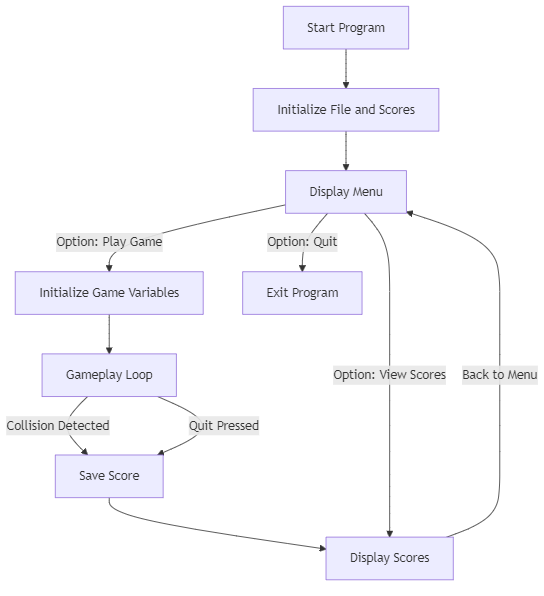

<div align="center">

# ClappyBird


</div>

## Table of Contents
- [ClappyBird](#clappybird)
  - [Table of Contents](#table-of-contents)
  - [Overview](#overview)
  - [Features🎯🎯🎯](#features)
  - [Prerequisites💻💻💻](#prerequisites)
  - [Files📂📂📂](#files)
  - [Compilation Instructions🛠️🛠️🛠️](#compilation-instructions️️️)
  - [Gameplay Instructions🎮🎮🎮](#gameplay-instructions)
  - [Control Flow🎞️🎞️🎞️](#control-flow️️️)
  - [Code Highlights](#code-highlights)
    - [Constants](#constants)
    - [Core Structures](#core-structures)
    - [Key Functions](#key-functions)
  - [Contributions🤝🤝🤝](#contributions)


---

## Overview

This project implements a console-based Flappy Bird game using the Windows API and C standard libraries. Players control a bird to navigate through obstacles while trying to achieve the highest score possible. The game features AI competition, score tracking, and an interactive menu system.

## Features🎯🎯🎯
- **Interactive Gameplay**: Players use the keyboard to control the bird.
- **AI Competitor**: Compete against an AI-controlled bird.
- **Score Saving**: Automatically saves and displays top scores.
- **Customizable Settings**: Adjust game settings such as screen dimensions, pipe distance, and aperture size.

## Prerequisites💻💻💻
- Windows operating system.
- C compiler (e.g., GCC or MSVC).

## Files📂📂📂
- `main.c`: Contains the game logic and implementation.
- `scores_list.txt`: File to save and retrieve player scores.

## Compilation Instructions🛠️🛠️🛠️
1. Ensure you have a C compiler installed.
2. Open a terminal or command prompt.
3. Navigate to the directory containing the `main.c` file.
4. Compile the program using the following command:
   ```bash
   gcc .\main.c -o flappy_bird.exe
   ```
5. Run the compiled program:
   ```bash
   ./flappy_bird.exe
   ```

## Gameplay Instructions🎮🎮🎮
1. Launch the game by running the executable.
2. Navigate the menu using the arrow keys and select an option with the `O` key.
3. Use the following controls during gameplay:
   - Press `W` to make the bird jump.
   - Press `Q` to quit the game.
4. Avoid pipes and the ground to keep the bird alive.
5. Try to survive as long as possible to achieve a high score.

## Control Flow🎞️🎞️🎞️
Below is the control flow of the game implemented in `main.c`:



[//]: # (```mermaid)
[//]: # (graph TD)
[//]: # (    A[Start Program] --> B[Initialize File and Scores])
[//]: # (    B --> C[Display Menu])
[//]: # (    C -->|Option: Play Game| D[Initialize Game Variables])
[//]: # (    D --> E[Gameplay Loop])
[//]: # (    E -->|Collision Detected| F[Save Score])
[//]: # (    E -->|Quit Pressed| F)
[//]: # (    F --> G[Display Scores])
[//]: # (    G -->|Back to Menu| C)
[//]: # (    C -->|Option: View Scores| G)
[//]: # (    C -->|Option: Quit| H[Exit Program])
[//]: # (```)

## Code Highlights
💡💡💡
### Constants
- **Screen Dimensions**: `HEIGHT`, `WIDTH`
- **Pipe Configurations**: `NoOfPipes`, `DIST`, `APERTURE`
- **File Configurations**: `FILENAME`

### Core Structures
- `entity`: Represents the bird and pipes with `x` and `y` coordinates.
- `list`: Holds player names and scores.

### Key Functions
- `clear_screen()`: Clears the console screen.
- `update_border()`, `update_pipes()`, `update_birds()`: Update the visual elements on the screen.
- `print_screen()`: Displays the current game state.
- `collision()`: Detects collisions with pipes or the ground.
- `fetch_scores()`, `write_to_file()`: Manage the score file.

## Contributions🤝🤝🤝
- **Rafay Siddiqui** (24K-0009)
- **Masoom Khan** (24K-0001)
- **Dev Kumar** (24K-0028)
