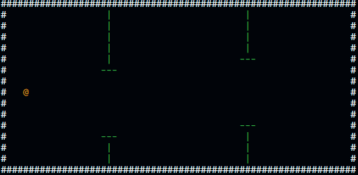
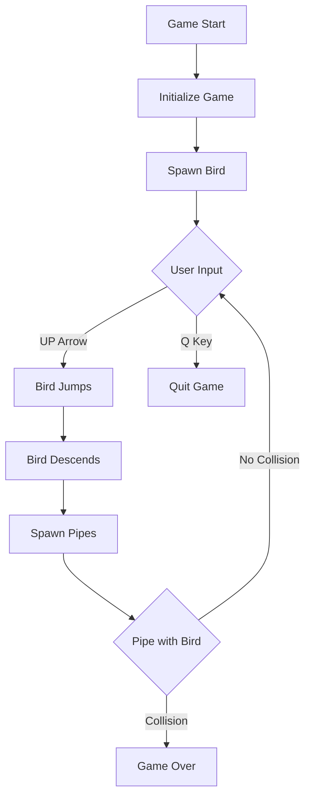

<div align="center">

# ClappyBird




</div>


## 📖 Overview
ClappyBird is a terminal-based game inspired by the classic Flappy Bird, implemented in C. The player controls a bird that must navigate through pipes by jumping at the right moments while avoiding collisions.

## 🎮 Game Mechanics and Functionality

### 🕹️ Controls
- **`Q`**: Quit the game
- **`UP Arrow` or `W`**: Make the bird jump/move upwards
  - After jumping, the bird will automatically descend at a constant rate.

### 🖼️ Game Environment
- The game is played within a defined frame with a specific height and width.
- The game updates at a consistent rate to ensure smooth gameplay.

### 🧩 Core Components

#### 🐦 Bird
- **Characteristics**:
  - Single bird type.
  - Movement:
    - User-controlled upward jump.
    - Automatic downward descent.
  - Collision Detection:
    - The game ends if the bird hits pipes.

#### 🚧 Pipes
- **Types**:
  1. Up Pipe
  2. Middle Pipe
  3. Down Pipe

- **Behavior**:
  - Pipes spawn randomly within the game frame and move towards the bird.
  - Collision rules:
    - If the pipe type matches the bird's position, the game continues.
    - If there’s a mismatch, the game ends.

### 🔄 Gameplay Flow

<div align="center">



</div>


### 🛠️ Technical Implementation Notes

#### Key Functions

```C
void main();     // Set up game main(){ }
void draw();     // Handle bird movement and rendering
void quit();     // Handle quitting the game
void collision(); // Detect bird-pipe interactions
```

### Recommended Libraries
- Windows Console Graphics
- Random number generation
- Time-based updates
### 📊 Performance Considerations
- Efficient screen clearing.
- Minimal computational overhead.
- Smooth frame updates.
### 🚀 Potential Enhancements
- Score tracking.
- Difficulty progression.
- Multiple bird/pipe skins.
### 🛡️ Error Handling
- Graceful game exit.
- Input validation.
- Memory management.
### 🎉 Credits
- https://github.com/R4F4I (Rafay Siddiqui)
- https://github.com/jetstarfish5599 (Masoom Khan)
- https://github.com/devutmani (Dev Uthmani)

